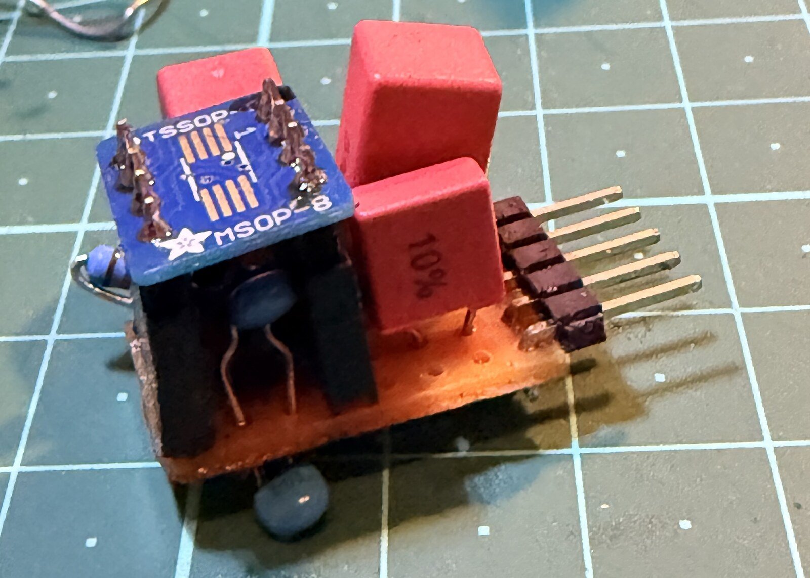

Episode 2 closed with a to-do list. Top of it: replace the JFET buffer that conditions the piezo signal with an **OPA1642 op-amp daughter board** — better low end, simpler bias. This is that swap, plus the on-pedal tooling I built to gain-stage it.

<!-- TODO: video embed — replace VIDEO_ID with the real YouTube id -->
<div class="video-embed">
  <iframe src="https://www.youtube.com/embed/VIDEO_ID" title="Pico Tone Trixter — op-amp front end demo" frameborder="0" allow="accelerometer; autoplay; clipboard-write; encrypted-media; gyroscope; picture-in-picture" allowfullscreen></iframe>
</div>

---

## The Board

<!-- TODO: hero photo of the OPA1642 daughter on the bench -->


One half of an OPA1642 — a FET-input audio op-amp — as a single-5V-rail preamp with +6 dB of gain, biased around a 2.5 V midrail. FET input because the K&K piezo needs a ≥1 MΩ high-impedance load. It drops into the exact same socket as the JFET buffer, so it's a straight A/B swap.

## Three Bugs in One Build

First power-up: the output slammed to the rail and stayed there. The fix came from walking the DC voltages across the chip's own pins — two faults stacked: a **missing feedback resistor** (no feedback → the amp rails), and once that was in, a **solder bridge shorting the inverting input to ground** (input clamped low → the amp rails *again*). Clear both and the output snapped to a clean 2.5 V midrail. Debugging by measuring the nodes, not guessing — a recurring theme on this project.

## Op-Amp vs JFET

Same signal-injector dongle, same input, both daughters measured. The op-amp delivers **~6 dB more signal per unit of input** than the JFET — confirmed and repeatable. The *noise* comparison was more humbling: both front ends' noise floors sit **at or below the bench scope's own noise floor** (~2–3 mV), so the scope literally can't measure the difference. That's a soundcard-FFT job for another day — and a good reminder that your instrument has a floor too.

## Tuning by the Numbers

The op-amp's fixed +6 dB is great for the weak passive K&K — but I tested first with a *hot active* pickup (a Garrison with its own preamp), and it overdrove the codec's ADC. To see it, I added a live level meter to the pedal, readable over UART:

```
comp in  -4.5 dBFS   GR  -6.3 dB   out  -0.5 dBFS   clip[ADC 0 DAC 0]
comp in  -2.1 dBFS   GR  -5.0 dB   out  -0.0 dBFS   clip[ADC 0 DAC 1]  *** CLIP ***
```

`clip[ADC …]` catches the front end overdriving the converter; `clip[DAC …]` catches the output. With that, gain-staging the hot pickup was straightforward: **floor the codec's input gain** to stop the ADC clipping, then **rebuild the level digitally** before the compressor so it still engages. Each preset now carries its own input-gain setting, so switching guitars re-stages the chain automatically.

## Where We Are

The op-amp front end is built, debugged, measured, and tuned — and through the full IR + EQ + compressor chain it sounds great. Next up is the pickup this was really built for: the passive K&K, which goes the *opposite* way — a weak signal that wants the gain turned up. Same tools, mirror-image problem.

---

Source, schematics, and firmware: [github.com/dylangmiles/pico-tone-trixter](https://github.com/dylangmiles/pico-tone-trixter)
