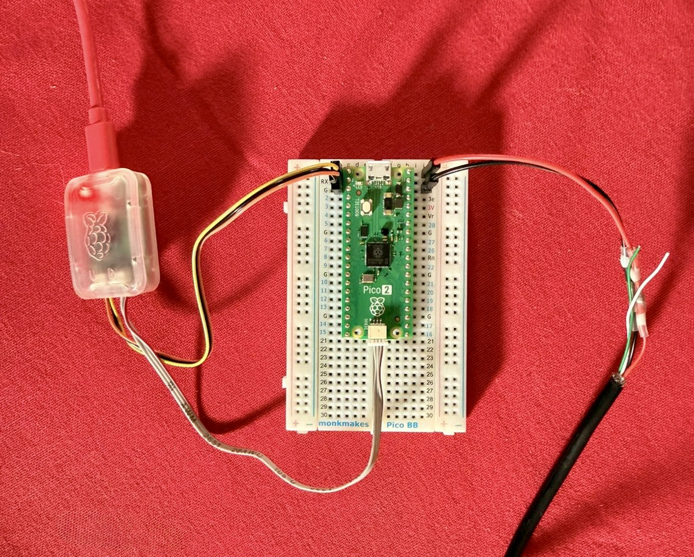
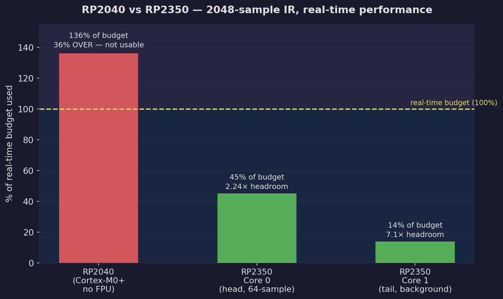
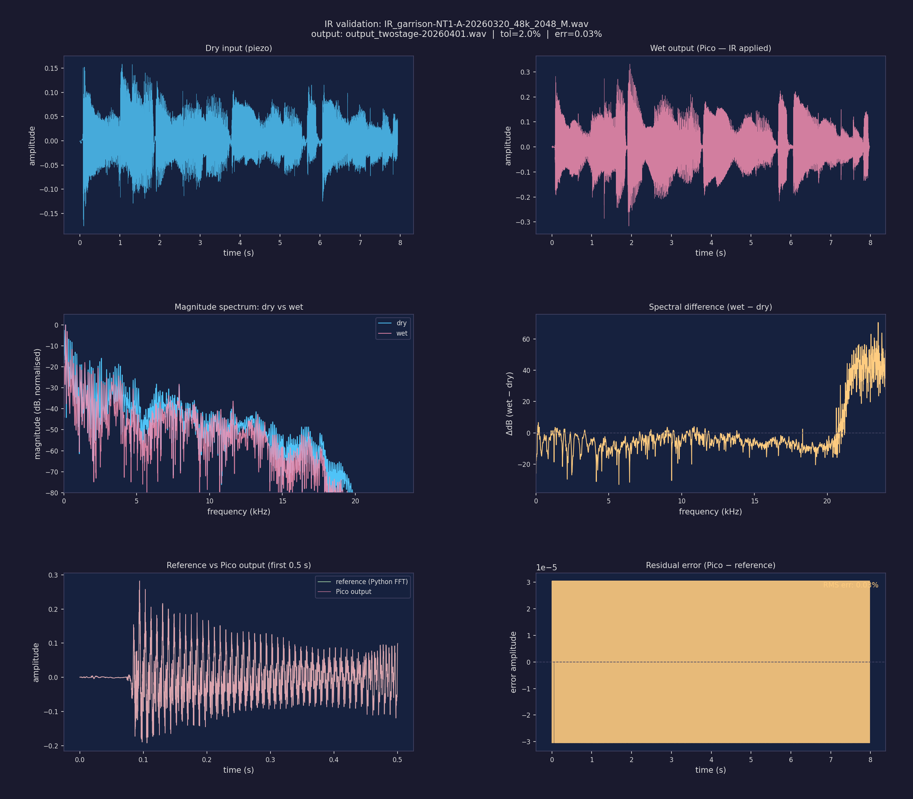

# Can a $7 Chip Sound Like a $300 Microphone?

April 2026 · Episode 1

Piezo pickups are everywhere in acoustic guitars. They're cheap, reliable, and fit neatly under the saddle. They're also, frankly, not great.

Compare a piezo pickup directly to a studio microphone on the same guitar and the difference is stark. The microphone hears the full acoustic resonance of the instrument — the warmth of the body, the air moving around the soundhole, the complex overtones of the top. The piezo hears the mechanical vibration at the saddle. It's brighter, thinner, and has what players call "quack" — a harsh, nasal quality that no amount of EQ quite fixes.

**Listen for yourself:**

<audio controls>
  <source src="assets/garrison-piezo-20260320.wav" type="audio/wav">
  <a href="https://media.githubusercontent.com/media/dylangmiles/pico-tone-trixter/main/docs/posts/2026-04-can-a-7-dollar-chip-sound-like-a-300-dollar-mic/assets/garrison-piezo-20260320.wav">Raw piezo — Garrison acoustic, undersaddle pickup</a>
</audio>

That's what most acoustic-electric guitars sound like through a PA or into a recording interface.

---

## The Idea

What if you could fix this in real-time, in a guitar pedal, using a $7 microcontroller?

The approach is called **impulse response convolution**. The idea:

1. Record the same guitar simultaneously through the piezo and a studio microphone
2. Calculate the difference between the two signals as an impulse response (IR)
3. Apply that IR to the live piezo signal in real-time

The IR captures the acoustic character of the guitar body and the microphone's response. Apply it and the piezo sounds like the mic was in the room.

This isn't new — professional IR loaders exist for guitar cabinets. But applying it to acoustic guitars in a real-time hardware pedal, at low latency, is the challenge.

---

## The Hardware

The microcontroller doing the work is a **Raspberry Pi Pico 2** — the RP2350 chip, dual Cortex-M33 cores at 150MHz, with a hardware floating-point unit. It costs about R95 at PiShop in South Africa.

The algorithm is **FFT convolution** using the [HiFi-LoFi FFTConvolver](https://github.com/HiFi-LoFi/FFTConvolver) library, running split across both cores:

- **Core 0** handles I2S audio I/O, DMA, and the "head" blocks (low-latency path)
- **Core 1** handles the "tail" convolution in the background

Target latency: under 3ms end-to-end.

---

## First Problem: Not Fast Enough

The first version ran on an RP2040 (original Pico). The algorithm was correct — the IR was being applied — but the processing was too slow for real-time use.

With a 2048-sample IR (42.7ms of acoustic response, enough to capture the guitar body resonance), the RP2040 was running at **136% of real-time budget**. 36% over what the hardware could handle. Not usable.

The bottleneck was the Ooura FFT running in software floating-point on the Cortex-M0+ — no hardware FPU.

---

## The Fix: Hardware FPU

The RP2350 (Pico 2) has a Cortex-M33 with a hardware floating-point unit. The same FFT that crawled on the RP2040 runs dramatically faster.

**Measured results on RP2350 with 2048-sample IR:**

| Stage | Per call | Budget | Headroom |
|---|---|---|---|
| Core 0 (head, 64-sample blocks) | 0.60ms | 1.33ms | **2.24×** |
| Core 1 (tail, background) | 1.5ms | 10.7ms | **7.1×** |

The algorithm went from 36% over budget to 7× headroom in a single hardware swap. The RP2350's hardware FPU delivered approximately 24× speedup on the tail convolution alone.

---

## Does It Actually Work?

To validate before wiring up real-time hardware, I ran an offline test: embedded 7.9 seconds of piezo recording directly in the firmware, processed it through the convolver, and streamed the result back over UART to the host.

**The result:**

<audio controls>
  <source src="assets/output_twostage-20260401.wav" type="audio/wav">
  <a href="https://media.githubusercontent.com/media/dylangmiles/pico-tone-trixter/main/docs/posts/2026-04-can-a-7-dollar-chip-sound-like-a-300-dollar-mic/assets/output_twostage-20260401.wav">Processed output — same recording, IR applied on Pico 2</a>
</audio>

The validation plot below shows the frequency response before and after — the IR is clearly reshaping the signal, and the Pico's output matches a Python reference convolution within 2% RMS error:

Six automated checks run after every capture: output length, signal modification, spectral shape change, and numerical accuracy against a Python reference. All pass.

---

## How the IR Was Captured

The IR for this project was captured using a **Universal Audio Gigcaster 8** audio interface, recording the guitar simultaneously on two channels — piezo direct and an NT1-A condenser microphone — with no processing applied to either signal. About 3–4 minutes of playing up and down the neck.

The IR was then generated using the [Cuki IR Generator](https://github.com/kienphanhuy/Cuki-IR-generator-Python), a Python/Colab tool that performs the deconvolution, and validated in the DAW using Nembrini's IR Loader plugin before moving to the bench.

Full capture methodology: [docs/ir_capture_guide.md](../../ir_capture_guide.md)

---

## Where We Are

The algorithm is proven. The hardware is fast enough. The next step is wiring up the live signal chain — ADC, preamp, DAC, and the Pico 2 — to get audio flowing in real-time.

Components are on their way. Next article: first live audio through the prototype.

---

**GitHub:** [pico-tone-trixter](https://github.com/dylangmiles/pico-tone-trixter)

*Built in Cape Town, South Africa.*
